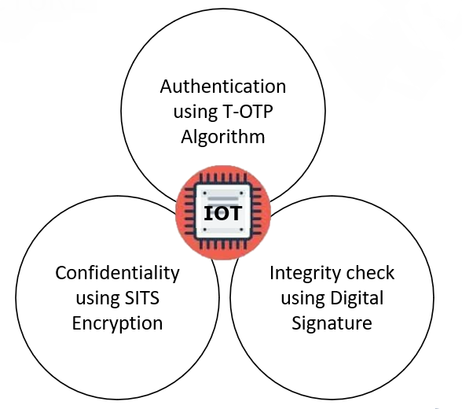
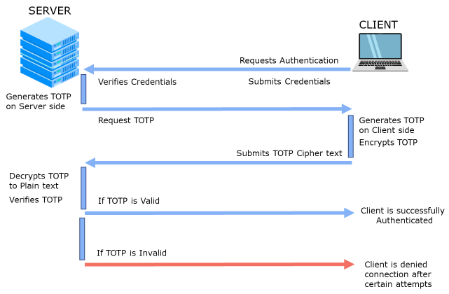
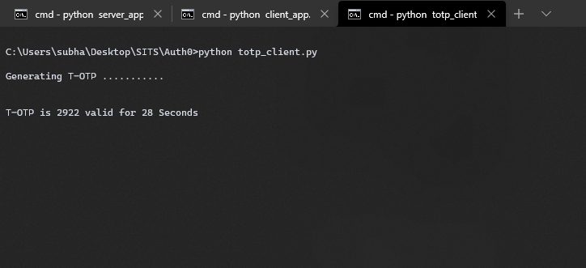
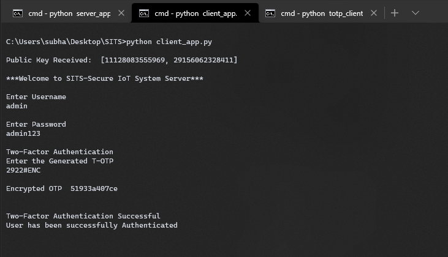
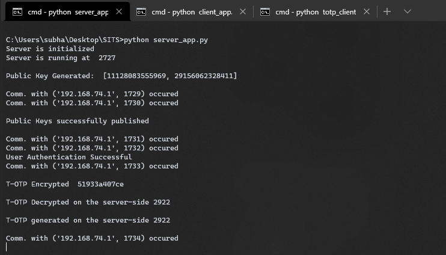
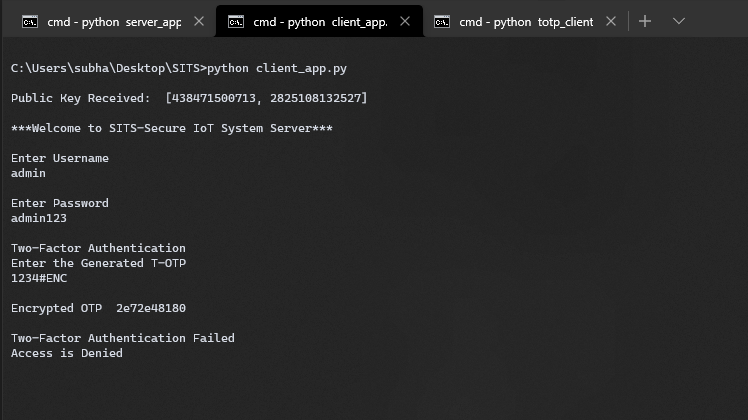
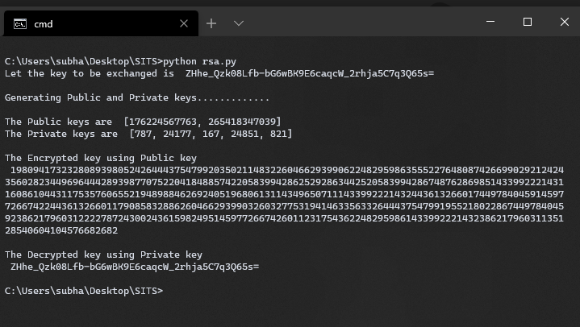
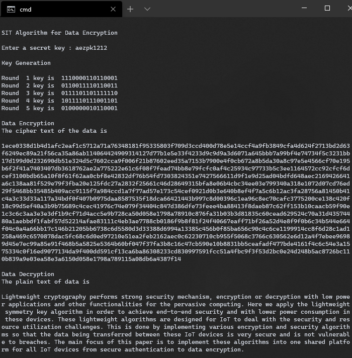

# SITS-Secure-IoT-System

#### SITS is a secure IoT system that implements lightweight cryptography which performs strong security mechanism, encryption or decryption with low power applications. Here we apply the lightweight cryptographic algorithms in order to achieve end-to-end security and with lower power consumption in these devices. These lightweight algorithms are designed for IoT to deal with the security and resource utilization challenges.

 

### 🖥️ Technologies and Tools used

#### 📊 Get Presentation Here  

 

## ABSTRACT
The Internet of Things (IoT) being a promising technology of the future is expected to connect billions of devices. With the passage of time more and more devices like wearables, home automation devices, industrial automation devices are getting connected to the internet. The sophisticated chips and sensors that are embedded in these devices collect valuable data. These devices will create a huge and complex network where a massive amount of data is communicated throughout the network. This process of sharing such large amount of data begins with the devices themselves and this increases number of communications which generates mountains of data and the security of data can be a threat. To adopt the IoT technology it is necessary to build the confidence among the users about its security and privacy that it will not cause any threat to their data integrity, confidentiality and authority. 

There are many challenges and issues like power consumption of devices, limited battery, memory, space, performance cost hence IoT are not suitable for the implementation of computationally expensive encryption algorithms. Conventional encryption algorithms are generally computationally expensive due to their complexity and requires many rounds to encrypt, essentially wasting the constrained energy of the gadgets. Less complex algorithm, however, may compromise the desired integrity. Hence there is a requirement to adopt lightweight cryptography which performs strong security mechanism, encryption or decryption with low power applications and other functionalities for the pervasive computing. Here we apply the lightweight symmetry key algorithm in order to achieve end-to-end security and with lower power consumption in these devices. These lightweight algorithms are designed for IoT to deal with the security and resource utilization challenges. With so many applications eyeing to adapt the technology with the intentions to contribute in the growth of economy, healthcare facility, transportation and a better life style for the public, IoT must offer adequate security to their data to encourage the adaptation process. there is significant concern to provide security at the same time reducing the cryptography’s footprints by the use of lightweight cryptography.

## INTRODUCTION
The Internet of Things (IoT) is turning out to be an emerging discussion in the field of research as our daily life is becoming smarter and easier because of this well recognised emerging technology and due to its practical implementation in the recent years we have been learning more and more about this system. IoT is a model that includes ordinary entities with the capability to sense and
communicate with fellow devices using Internet. As the broadband Internet is now generally accessible and its cost of connectivity is also reduced, more gadgets and sensors are getting connected to it. Such conditions are providing suitable ground for the growth of IoT. There is great deal of complexities around the IoT, since we wish to approach every object from anywhere in the world. The sophisticated chips and sensors are embedded in the physical things that surround us, each transmitting valuable data. The process of sharing such large amount of data begins with the devices themselves which must securely communicate with the IoT platform. The IoT is taking the
conventional internet, sensor network and mobile network to another level as everything will be connected to the internet. A matter of concern that must be kept under consideration is to ensure the issues related to confidentiality, data integrity and authenticity that will emerge on account ofsecurity and privacy.

This project was prepared was prepared in such a way to as to meet the above requirements as efficiently and reliably as possible. This is done by implementing various encryption and security algorithms so that the data being transferred between these IoT devices is very secure and is not vulnerable to breaches. The main focus of this project is to implement these algorithms into one shared platform for all IoT devices from secure authentication to data encryption.

## ARCHITECTURE

MODULES

TOTP

## APPLICATION ARCHITECTURE

TOTP GENERATION

AUTHENTICATION

SERVER-SIDE AUTHENTICATION

AUTHENTICATION DENIED

RSA KEY EXCHANGE

SIT ENCRYPTION

[📃 Project Report Here](/Docs/Project%20Report.pdf)
